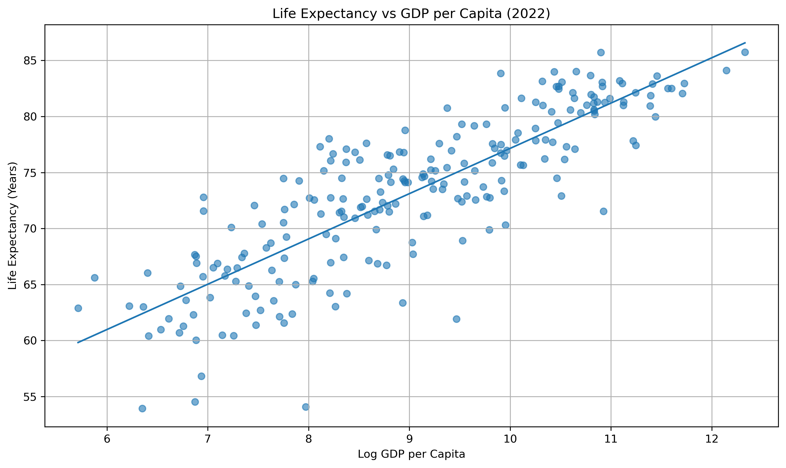
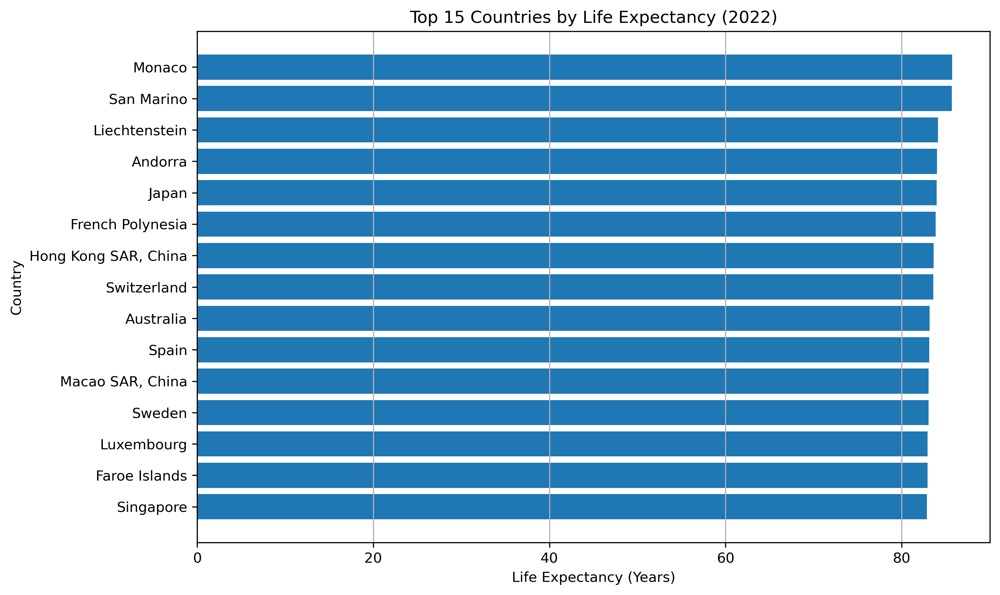
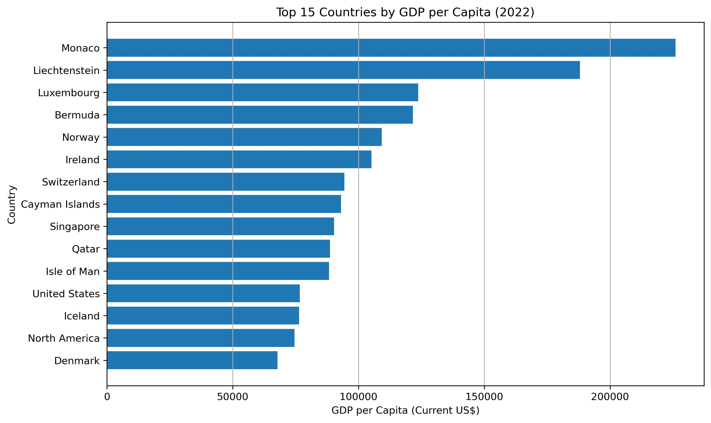

# 🌍 Global Life Expectancy vs Economic Development

## 📌 Overview

This project investigates the relationship between economic development and public health outcomes across countries.

Using World Bank data, the analysis explores whether higher GDP per capita is associated with higher life expectancy.

The project demonstrates a full data analysis workflow, including data cleaning, transformation, visualization, and statistical analysis.

---

## ❓ Research Question

**Does higher GDP per capita correlate with higher life expectancy across countries?**

---

## 📊 Data Sources

Data was obtained from the World Bank Open Data platform:

* GDP per capita (current US$) — `NY.GDP.PCAP.CD`
* Life expectancy at birth (years) — `SP.DYN.LE00.IN`

The analysis focuses on the most recent available year: **2022**.

---

## 🧹 Data Preparation

The following steps were performed:

* Removed metadata rows from raw CSV files
* Converted data from **wide format to long format**
* Dropped irrelevant columns (indicator names and codes)
* Merged GDP and life expectancy datasets
* Filtered data for the year **2022**
* Removed missing values
* Excluded non-country aggregate regions (e.g., "World", "Europe & Central Asia")
* Applied a **log transformation** to GDP per capita to handle skewness

---

## 📈 Methodology

* Created a scatter plot of **log GDP per capita vs life expectancy**
* Fitted a linear regression trend line
* Computed the **Pearson correlation coefficient**

---

## 🔍 Key Findings

- Strong positive correlation (**r = 0.84**) between GDP per capita and life expectancy
- Higher-income countries generally have longer life expectancy
- The relationship shows diminishing returns at higher income levels
- Lower-income countries show greater variation, suggesting other factors also affect health outcomes

---

## 📊 Visualization

The scatter plot below illustrates the relationship between economic development and life expectancy:

### Life Expectancy vs GDP per Capita


### Top 15 Countries by Life Expectancy


### Top 15 Countries by GDP per Capita



---

## 🧠 Interpretation

The findings suggest that economic development plays a significant role in improving health outcomes. However, beyond a certain income level, further increases in GDP have a smaller impact on life expectancy.

This indicates that factors such as healthcare systems, education, and public policy also play critical roles.

---

## 🛠️ Tools & Technologies

* Python (Pandas, NumPy, Matplotlib)
* Jupyter Notebook
* World Bank Open Data

---

## 📁 Project Structure

```
life-expectancy-analysis/
│
├── data/
│   ├── raw/
│   └── cleaned/
│
├── notebooks/
│   └── 01_data_loading.ipynb
│
├── visuals/
│
└── README.md
```

---

## 🚀 Future Improvements

* Include additional variables (e.g., healthcare spending, education)
* Perform regression analysis with multiple predictors
* Analyze trends over time instead of a single year

---

## 📬 Contact

If you have any questions or feedback, feel free to connect with me on LinkedIn.

---
